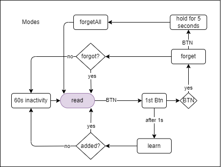

# rf control monitor

## TODOs

- read from EEPROM.
- write to EEPROM.
- send data ...

## Button

here is the funtionality diagram for external button:

<!-- 
commit notes:
added debunce to read command function
implement functionality to LEDs
filter remotes 
connect push button to add new remote.
remove remote.
-->
