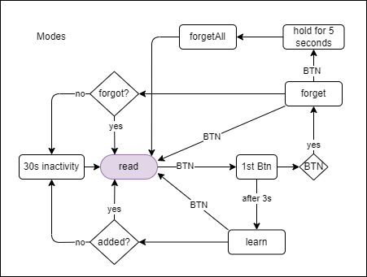

# rf control monitor

## TODOs

- [ ] send data ...
- [x] watchdog timer.
- [x] read from EEPROM. (implemented but commented)
- [x] write to EEPROM. (implemented but commented)

## Button

here is the funtionality diagram for external button:

<!-- 
commit notes:
added debunce to read command function
implement functionality to LEDs
filter remotes 
connect push button to add new remote.
remove remote.
-->
